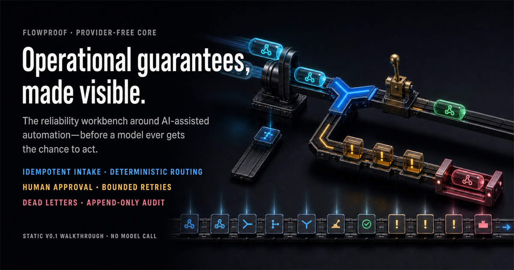

<h1 align="center">FlowProof</h1>

<p align="center"><strong>A reliability workbench for AI-assisted automations.</strong><br/>
Makes the operational guarantees around an automation <em>visible</em>: duplicate protection, deterministic routing, human approval, bounded retries, dead letters, and an append-only audit history.</p>

<p align="center">
  <a href="https://github.com/Lancimoun/flowproof/actions/workflows/ci.yml"></a>
  
  
  
  
  
</p>

<p align="center">
  <a href="https://lancimoun.github.io/flowproof/"><strong>▶ Live demo</strong></a> ·
  <a href="#what-works-now">What works now</a> ·
  <a href="#api">API</a> ·
  <a href="#run-locally">Run locally</a> ·
  <a href="#verify">Verify</a>
</p>



---

## What it is

FlowProof evaluates the **workflow around a model**, not the model itself — delivery, routing, approvals, retries, and traceability. Agent Reliability Arena scores what a model *says*; FlowProof proves what the system *does* with it.

This is a local `v0.1` vertical slice. It does not call an AI provider yet and is not deployed as a service. Ambiguous work is routed to an `ai_assist` queue **behind human approval**, so a future model adapter can be added without weakening the safety boundary.

## What works now

- **Idempotent delivery** — `POST /webhooks` with an `Idempotency-Key` creates at most one workflow. First delivery returns `201`; a replay returns `200` with the original workflow and `duplicate: true`, because the retry created nothing.
- **Deterministic routing** — safe events complete through rules; high-risk events route to `human_review` and wait; ambiguous events route to `ai_assist` **without** calling a model or firing a side effect.
- **Named-reviewer approval** — decisions require a named reviewer; deciding a workflow that is not `pending_approval` returns `409`.
- **Bounded retries → dead letter** — a failed attempt is durable and capped at **three**: failures one and two become `retry_pending`; failure three becomes `dead_letter` and can never run again.
- **Append-only audit** — every creation, duplicate, decision, failed attempt, and dead letter is recorded in SQLite and cannot be edited away.

## API

| Method | Path | Description |
|---|---|---|
| `GET` | `/health` | Liveness probe |
| `POST` | `/webhooks` | Idempotent workflow creation (`Idempotency-Key`) |
| `GET` | `/workflows/{id}` | Fetch a workflow and its full audit trail |
| `POST` | `/workflows/{id}/decision` | Named-reviewer approve / reject |
| `POST` | `/workflows/{id}/failure` | Record a failed attempt (bounded → `dead_letter`) |

## Using the core as a library

The HTTP table above is the service contract. Underneath it is `flowproof.core`,
which holds every rule and the ledger and depends on **no provider, no network and
no credentials** — that is what "provider-free" means here, and it is testable
without running the API at all.

```python
from flowproof.core import InvalidTransition, WorkflowStore

store = WorkflowStore(database=":memory:", max_attempts=3)
store.ingest("evt-1", "payout.requested", {"amount": 5000})  # -> pending_approval
```

The checked-in example is executable and CI runs it on every push:

```bash
python -m examples.ledger_demo
```

```text
safe event    : status=completed  route=rules
replayed      : duplicate=True  same_id=True
risky event   : status=pending_approval  route=human_review
decided       : status=approved
decided twice : refused -> InvalidTransition
ambiguous     : status=pending_approval  route=ai_assist
failure 1     : status=retry_pending
failure 2     : status=retry_pending
failure 3     : status=dead_letter
audit trail   : 6 entries, oldest=workflow_created
```

Note what routing reads: **the payload, not the event name**. `refund.requested`
for 40 completes through rules; `payout.requested` for 5000 crosses the amount
threshold and waits for a named human. `needs_interpretation` routes to `ai_assist`
and also waits — **without contacting a model**, which is the safety boundary a
future adapter has to slot behind rather than around.

A test re-runs this file and asserts the block above matches its real output, so
the documentation cannot drift from the code while still looking correct.

## Live demo

**▶ [lancimoun.github.io/flowproof/](https://lancimoun.github.io/flowproof/)** — a self-contained walkthrough of safe routing, human approval, idempotent replay, bounded retries, dead letters, and the audit ledger. Served free from GitHub Pages out of `/docs`, with no backend and no external assets. Open `docs/index.html` locally for the same thing offline.

## Run locally

```powershell
python -m venv .venv
.\.venv\Scripts\python -m pip install -r requirements-dev.txt
.\.venv\Scripts\python -m uvicorn flowproof.api:app --reload
```

Open `http://127.0.0.1:8000/docs` for the interactive API. Example:

```bash
curl -X POST http://127.0.0.1:8000/webhooks \
  -H "Content-Type: application/json" \
  -H "Idempotency-Key: payment-42" \
  -d '{"event_type":"payment.requested","payload":{"amount":2500}}'
```

## Verify

```powershell
python -m unittest discover tests -v
```

**42 tests:** 9 stdlib tests pin the core ledger, 4 run the README's own example and compare the documentation against its real output, 20 contract tests pin the HTTP surface and warning policy (replay, retry, `404`, `409`, `422`), and 9 static/release tests keep the public illustration, social card, and CI contract honest, self-contained, recoverable, and responsive.

The reliability core is **provider-free and stdlib-only by design** — so that command needs no install: the 9 core tests and 9 static/release tests run while the 20 API tests report as skipped. Run `python run_tests.py` from the virtualenv to exercise the HTTP surface under FlowProof's fatal Starlette-warning policy. The guarantees stay testable offline, and the FastAPI and future AI adapters sit thinly around them.

## Next slices

- Pluggable AI adapter with recorded prompts/responses and deterministic fallback.
- Connect the static demo to the real approval queue, only after a deployment target is explicitly approved.
- Container packaging before any live service release.

---

<p align="center"><sub>MIT · Built by <a href="https://github.com/Lancimoun">Architect L.</a> with Claude Code</sub></p>
